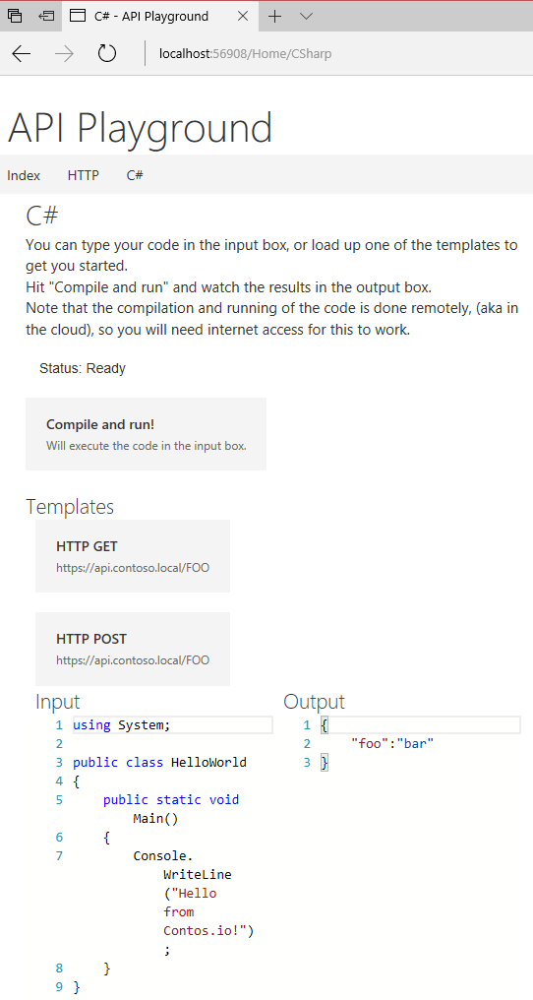

## API-Playground

### Description
This solution contains a utility web page for testing APIs. It is based on Visual Studio 2017 and .NET Core 2.

It currently provides the ability to test "raw" C# code for achieving this. Technically it can be used for C# testing in general as well. (It is not hardcoded for API calls in any way.)

There are templates for a generic GET or POST call which you can edit to your liking to create a more realistic test scenario.

Adding more templates currently requires you to add in a JavaScript function, and a button html tag, to load into the editor view. Slighly unflexible, but there is no actual templating system implemented yet.

#### Notes
The editor view is provided by using the Monaco-Editor: [https://github.com/Microsoft/monaco-editor](https://github.com/Microsoft/monaco-editor)

The compilation and running of the code requires internet access as it is sent to "the cloud" for execution. It does not run locally yet (working on that).

HTML testing (visible in screenshot) has been deprectated, but you can find it in previous commits if you like.